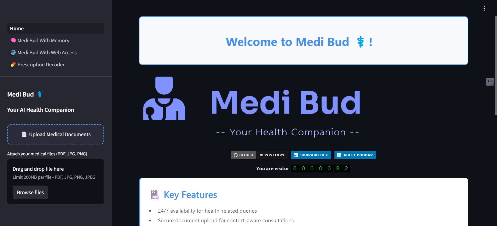

<div align="center">

# Medi Bud - AI Powered Medical Chatbot 

[](https://opensource.org/licenses/Apache-2.0)
[](https://github.com/firstcontributions/open-source-badges) 

[](https://www.linkedin.com/in/ahelipoddar/) 
[](https://www.linkedin.com/in/sourabh-dey/) 

---


*Your AI Health Companion - Powered by RAG AND LLM WITH MEMORY RETAINING CAPACITY*

---
<div align="left">

## Overview

**Medi Bud** is an AI-powered medical chatbot designed to assist users with health-related queries, document uploads, and prescription analysis. It provides a preliminary level of health guidance and can direct users to appropriate healthcare actions. Leveraging the power of large language models like OpenAI’s GPT, Google Gemini, and Llama3, Medi Bud offers an interactive way to understand and explore basic medical information, medications, and diagnoses.

> **Note**: This chatbot is intended for **informational purposes only**. Always consult a healthcare professional for any medical advice.

---


## Key Features

- 🩺 **AI-Based Health Consultation**:  
   Medi Bud can answer common health-related queries, offering general insights and preliminary guidance based on user-provided information.
   
- 📄 **Document Upload & Analysis**:  
   Users can upload medical documents such as prescriptions or diagnostic reports. Medi Bud can extract and analyze the information in these documents, providing meaningful responses.

- 💊 **Prescription Analysis**:  
   Ask specific questions about medications, dosages, potential side effects, and more. Medi Bud analyzes the uploaded prescription and responds accordingly.

- 🔍 **OCR for Text Complex Prescription/Report Extraction**:  
   Enhanced Optical Character Recognition (OCR) technology allows the bot to read text from prescription images and medical documents for further analysis.

- 💬 **Persistent Chat Memory**:  
   Users can interact with a memory-augmented version of Medi Bud, where previous conversations are retained, allowing for more context-aware responses.

- 🌐 **Web-Based Health Information Access**:  
   Medi Bud can fetch the latest medical information from the web for more comprehensive answers, enabling it to provide up-to-date medical knowledge.

---

## Usage Scenarios

- **Preliminary Consultations**:  
   Use Medi Bud to ask general health-related questions or for guidance on common symptoms and conditions.
   
- **Document Analysis**:  
   Upload a prescription or any medical document, ask specific questions, and receive understandable answers.

- **Patient Support in Remote Areas**:  
   The chatbot can provide vital information to patients who may not have easy access to healthcare professionals, directing them on whether they need further medical attention.

- **Educational Tool**:  
   Medi Bud can also be used by students or individuals learning about medicine, pharmacology, or healthcare to explore basic medical knowledge.

---

## Project Structure

Medi Bud is built as a modular system with the following main components:

### 1. Home Page
- The introductory page that welcomes the user and allows them to upload medical files.
- Includes a medical disclaimer to ensure users are aware of the limitations of the chatbot.

### 2. Med Bud With Memory
- A more advanced version of Medi Bud where chat memory is enabled, making the chatbot able to remember past interactions within the session and respond in a more contextually aware manner.

### 3. Med Bud With Internet Access
- This version of Medi Bud has access to the internet, allowing it to fetch real-time medical information, making it ideal for health-related research and answering queries that require up-to-date data.

### 4. Enhanced OCR Query
- This module allows users to upload images of prescriptions or medical documents. Medi Bud processes the images using OCR technology and answers questions related to the content, such as identifying medications, dosages, or usage instructions.

---

## Installation

To set up the project locally, follow the steps below:

1. **Clone the repository**:
   ```bash
   git clone https://github.com/XAheli/Medi_Bud.git
   cd Medi_Bud
